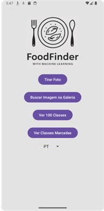
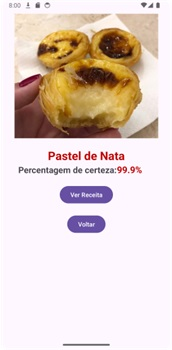
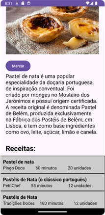

# Android Studio - Food Recognition with Machine Learning 
Este projeto tem como objetivo desenvolver uma aplicação móvel capaz de identificar o nome do prato de comida presente numa imagem usando modelos de CNN pré-existentes que foram customizados de forma a obter os melhores resultados.

Este projeto utiliza um modelo de deep learning para classificar imagens de pratos tradicionais da gastronomia portuguesa. A integração do modelo de Machine Learning, realizado com TensorFlow Lite, 
possibilita o processamento local das imagens e a identificação das classes correspondentes de forma eficiente.

Dataset utilizado para o modelo: https://github.com/RafaelRibeiro2003/Dataset-de-Comida-Portuguesa

Modelo utilizado para aplicação: https://github.com/RafaelRibeiro2003/Deep-learning-com-dataset-de-comida-portuguesa

## Interface da aplicação
## 1. Interface principal
Na página principal, o utilizador encontrará um logotipo na parte superior e quatro  botões principais assim como uma caixa de seleção. O primeiro botão permite tirar uma foto com a câmara do dispositivo para 
identificar os pratos de comida. O segundo botão permite selecionar uma imagem da 
galeria, útil para identificar pratos a partir de fotos armazenadas.

O terceiro botão leva o utilizador a uma lista de 100 classes de pratos. Ao selecionar 
uma classe desta lista, o utilizador é redirecionado para outra atividade que contém 
informações detalhadas e imagens sobre o prato escolhido. O quarto botão mostra as 
classes marcadas como favoritas, facilitando o acesso aos pratos de interesse.

Além desses botões, a interface também inclui uma caixa de seleção que permite ao 
utilizador selecionar o idioma desejado para traduzir os textos no aplicativo. Esta 
característica é crucial para os turistas que podem não perceber o português. Quando 
seleciona um idioma, a aplicação traduz, automaticamente, todo o texto visível para o 
idioma escolhido, proporcionando uma experiência mais inclusiva.

  

## 2. Interface de identificação do prato de comida
Na interface de identificação do prato de comida, os utilizadores podem visualizar 
a imagem capturada ou selecionada da galeria na interface da página principal. Abaixo 
da imagem, é mostrado o nome do prato identificado, bem como o percentual de 
certeza da identificação. Nesta imagem é mostrado um exemplo de identificação do 
pastel de nata com 99,9% de certeza.

  

O processo de identificação do prato é realizado usando o modelo de Machine 
Learning que foi previamente [treinado](https://github.com/RafaelRibeiro2003/Deep-learning-com-dataset-de-comida-portuguesa). Este modelo 
analisa a imagem fornecida e determina a classe da comida apresentada. A classe identificada é então apresentada ao utilizador.
Se a confiança do modelo na identificação for inferior a 80%, é apresentado uma  mensagem informando que o prato não foi reconhecido. Caso contrário, o nome do prato identificado é mostrado juntamente com a percentagem de certeza.

Na seguinte imagem é apresentado um exemplo de um prato parcialmente consumido e de 
má qualidade, identificado como um "Prato não reconhecido!", porque a percentagem 
de certeza foi inferior a 80%.

  

Além disso, dois botões são apresentados na parte inferior da interface: um para 
visualizar as receitas do prato de comida identificado e outro para retornar à página
principal, sendo que apenas o botão de retornar aparece no caso de o prato de comida
não ser reconhecido.

## 3. Interface das receitas da classe
Quando o utilizador clica no botão "Ver receita" na interface de identificação do 
prato, ele é encaminhado para uma nova interface dedicada a apresentar apenas três
receitas relacionadas do mesmo.

  

Nesta interface, a foto correspondente ao prato de comida é apresentada no topo, 
seguida de um resumo informativo sobre a classe.

Abaixo da imagem e do resumo, são apresentadas três receitas diferentes do 
cozinhado identificado, oferecendo ao utilizador diversas opções. Cada receita inclui 
um título, o nome do website do qual a receita foi tirada, a duração estimada para a 
preparação e o número de porções. Essas informações são organizadas de forma clara 
e acessível, facilitando a escolha da receita desejada.

O utilizador pode clicar em qualquer uma das receitas para ser encaminhado para 
o site correspondente, onde pode obter a receita detalhada. Esta funcionalidade 
permite uma experiência fluída, ligando o utilizador diretamente a fontes fiáveis de 
receitas, ajudando-o a explorar diferentes métodos de preparação do cozinhado
identificado.

Além disso, na parte inferior da interface, há um botão que permite ao utilizador
marcar ou desmarcar a receita como favorita. O estado atual do prato de comida é 
indicado pelo texto no botão, que alterna entre "Marcar" e "Desmarcar". Quando o 
utilizador marca uma receita, ela é armazenada como favorita, facilitando o acesso no 
futuro através da lista de classes marcadas.

