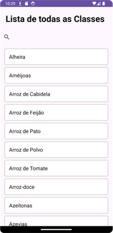
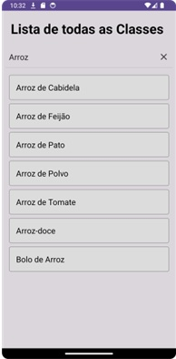
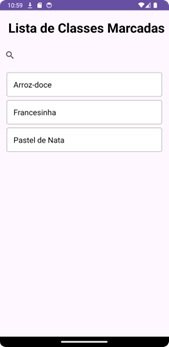
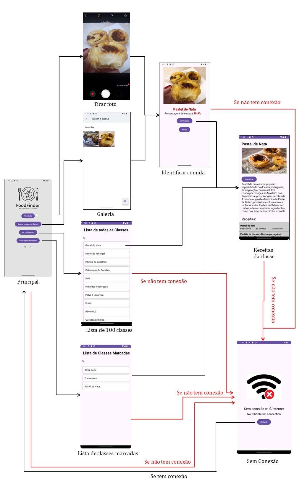
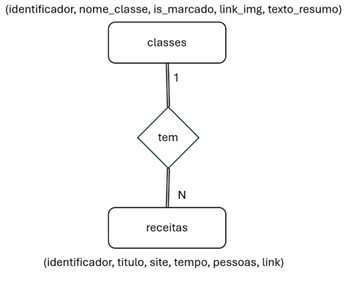

# Android Studio - Food Recognition with Machine Learning 
Este projeto tem como objetivo desenvolver uma aplicação móvel capaz de identificar o nome do prato de comida presente numa imagem usando modelos de CNN pré-existentes que foram customizados de forma a obter os melhores resultados.

Este projeto utiliza um modelo de deep learning para classificar imagens de pratos tradicionais da gastronomia portuguesa. A integração do modelo de Machine Learning, realizado com TensorFlow Lite, 
possibilita o processamento local das imagens e a identificação das classes correspondentes de forma eficiente.

Dataset utilizado para o modelo: https://github.com/RafaelRibeiro2003/Dataset-de-Comida-Portuguesa

Modelo utilizado para aplicação: https://github.com/RafaelRibeiro2003/Deep-learning-com-dataset-de-comida-portuguesa

## Interface da aplicação
## 1. Interface principal
Na página principal, o utilizador encontrará um logotipo na parte superior e quatro  botões principais assim como uma caixa de seleção. O primeiro botão permite tirar uma foto com a câmara do dispositivo para 
identificar os pratos de comida. O segundo botão permite selecionar uma imagem da 
galeria, útil para identificar pratos a partir de fotos armazenadas.

O terceiro botão leva o utilizador a uma lista de 100 classes de pratos. Ao selecionar 
uma classe desta lista, o utilizador é redirecionado para outra atividade que contém 
informações detalhadas e imagens sobre o prato escolhido. O quarto botão mostra as 
classes marcadas como favoritas, facilitando o acesso aos pratos de interesse.

Além desses botões, a interface também inclui uma caixa de seleção que permite ao 
utilizador selecionar o idioma desejado para traduzir os textos no aplicativo. Esta 
característica é crucial para os turistas que podem não perceber o português. Quando 
seleciona um idioma, a aplicação traduz, automaticamente, todo o texto visível para o 
idioma escolhido, proporcionando uma experiência mais inclusiva.

  

## 2. Interface de identificação do prato de comida
Na interface de identificação do prato de comida, os utilizadores podem visualizar 
a imagem capturada ou selecionada da galeria na interface da página principal. Abaixo 
da imagem, é mostrado o nome do prato identificado, bem como o percentual de 
certeza da identificação. Nesta imagem é mostrado um exemplo de identificação do 
pastel de nata com 99,9% de certeza.

  

O processo de identificação do prato é realizado usando o modelo de Machine 
Learning que foi previamente [treinado](https://github.com/RafaelRibeiro2003/Deep-learning-com-dataset-de-comida-portuguesa). Este modelo 
analisa a imagem fornecida e determina a classe da comida apresentada. A classe identificada é então apresentada ao utilizador.
Se a confiança do modelo na identificação for inferior a 80%, é apresentado uma  mensagem informando que o prato não foi reconhecido. Caso contrário, o nome do prato identificado é mostrado juntamente com a percentagem de certeza.

Na seguinte imagem é apresentado um exemplo de um prato parcialmente consumido e de 
má qualidade, identificado como um "Prato não reconhecido!", porque a percentagem 
de certeza foi inferior a 80%.

  

Além disso, dois botões são apresentados na parte inferior da interface: um para 
visualizar as receitas do prato de comida identificado e outro para retornar à página
principal, sendo que apenas o botão de retornar aparece no caso de o prato de comida
não ser reconhecido.

## 3. Interface das receitas da classe
Quando o utilizador clica no botão "Ver receita" na interface de identificação do 
prato, ele é encaminhado para uma nova interface dedicada a apresentar apenas três
receitas relacionadas do mesmo.

  

Nesta interface, a foto correspondente ao prato de comida é apresentada no topo, 
seguida de um resumo informativo sobre a classe.

Abaixo da imagem e do resumo, são apresentadas três receitas diferentes do 
cozinhado identificado, oferecendo ao utilizador diversas opções. Cada receita inclui 
um título, o nome do website do qual a receita foi tirada, a duração estimada para a 
preparação e o número de porções. Essas informações são organizadas de forma clara 
e acessível, facilitando a escolha da receita desejada.

O utilizador pode clicar em qualquer uma das receitas para ser encaminhado para 
o site correspondente, onde pode obter a receita detalhada. Esta funcionalidade 
permite uma experiência fluída, ligando o utilizador diretamente a fontes fiáveis de 
receitas, ajudando-o a explorar diferentes métodos de preparação do cozinhado
identificado.

Além disso, na parte inferior da interface, há um botão que permite ao utilizador
marcar ou desmarcar a receita como favorita. O estado atual do prato de comida é 
indicado pelo texto no botão, que alterna entre "Marcar" e "Desmarcar". Quando o 
utilizador marca uma receita, ela é armazenada como favorita, facilitando o acesso no 
futuro através da lista de classes marcadas.

## 4. Interface da lista de 100 classes
A interface da lista de 100 classes apresenta uma lista ampla de classes disponíveis, 
permitindo que o utilizador explore as várias opções culinárias que o aplicativo é capaz 
de identificar no momento, como apresentado nesta imagem.

  

Logo abaixo do título, há uma barra de pesquisa intuitiva que facilita a navegação. 
Este recurso permite que o utilizador pesquise diretamente por uma classe específica, 
digitando palavras-chave relacionadas. À medida que o utilizador digita, a lista é 
filtrada em tempo real, mostrando apenas as classes que correspondem aos critérios 
de pesquisa. Isso torna a navegação mais eficiente, especialmente quando o utilizador
tem uma classe específica em mente. Na seguinte imagem apresenta um exemplo de pesquisa 
de arroz.

  

Cada item na lista representa uma classe e inclui o nome da classe. Quando se clica 
em qualquer classe na lista, é-se direcionado para a interface da receita da classe 
correspondente. Nesta interface, como mencionado anteriormente, os utilizadores
encontrarão a imagem representativa da classe, um resumo informativo e uma seleção 
de três receitas relacionadas ao prato identificado.

## 5. Interface da lista de classes marcadas
Esta interface é semelhante à da lista de 100 classes, mas com uma distinção 
importante: mostra apenas as classes marcadas. Isso é feito para tornar mais fácil os 
utilizadores encontrarem rapidamente as classes que marcaram anteriormente, 
tornando a experiência mais personalizada e eficiente.

Ao abrir a interface, o utilizador é recebido com uma lista das classes marcadas. Ele 
pode navegar por essa lista e, se necessário, utilizar a barra de pesquisa para encontrar 
uma classe específica mais rapidamente.
Essa abordagem permite que o utilizador tenha acesso facilmente a informações 
sobre as classes que são do seu interesse, evitando a necessidade de percorrer uma
extensa lista de classes. Desta forma, a interface de lista de classes marcadas oferece 
uma experiência mais focada e direcionada para atender às necessidades individuais 
dos utilizadores.

Na seguinte imagem é apresentado um exemplo da lista de classes marcadas, onde constam
as classes arroz-doce, pastel de nata e francesinha. É importante lembrar que para 
marcar uma classe, o utilizador deve navegar pela lista, e procurar a classe desejada, 
entrar nessa classe e clicar no botão marcar.

  

## 6. Interface sem conexão
A interface sem conexão, apresentada na seguinte imagem, é ativada quando não há 
conexão ao Wi-Fi com o dispositivo móvel. Esta tela simples apresenta uma mensagem 
clara, "Sem conexão wi-fi/Internet", indicando ao utilizador o motivo pelo qual o 
aplicativo não pode aceder os recursos online.

  

Além disso, um botão " Refresh" é apresentado que permite ao utilizador tentar uma 
conexão novamente. Ao clicar no botão "Refresh", o aplicativo tentará verificar 
novamente se a conexão com a internet foi estabelecida. Se sim, o utilizador será 
encaminhado para a interface principal do aplicativo. Caso contrário, a interface sem 
conexão será mantida até que uma conexão adequada seja restabelecida.

A necessidade de uma conexão ativa com a internet está diretamente relacionada à 
funcionalidade crucial desta aplicação: a tradução automática. Sem uma conexão com 
a internet, o aplicativo não terá acesso aos recursos necessários para realizar traduções 
automaticamente.

## Fluxograma de interface do aplicativo
Na seguinte imagem mostra um fluxograma que ilustra as interfaces do aplicativo 
FoodFinder. Esses diagramas facilitam a visualização e a compreensão de como o 
aplicativo funciona, mostrando de forma clara e organizada como cada interface está 
interconectada e como os utilizadores podem navegar pelas diferentes secções da 
interface.

  

## SQLite Database
Nesta secção, será abordada a integração de um banco de dados SQLite no aplicativo 
Android, desenvolvido no Android Studio. Este capítulo centra-se na estrutura da base 
de dados, que inclui duas tabelas principais: "classes" e "receitas". Estas tabelas são 
essenciais para organizar e fornecer informações sobre várias receitas culinárias 
típicas, oferecendo uma experiência rica e informativa para os turistas que querem 
explorar a culinária local.

A tabela "classes" armazena informações sobre diferentes pratos típicos. Cada 
registo na seguinte tabela representa um prato distinto, como cozido à portuguesa, sardinha, 
pastel de nata e entre outros. A estrutura do quadro "classes" é definida da seguinte 
forma:
| Atributo | Significado |
| --------------- | --------------- |
| identificador   | Identificador textual exclusivo para cada classe.    |
| nome_classe    | Nome da classe.    |
| is_marcado    | Indicador booleano que pode ser usado para marcar a classe como favorito ou destacado.    |
| link_img    | URL da imagem representativa da classe.    |
| texto_resumo    | Resumo descritivo sobre a classe.    |

Foi decidido utilizar links do Google para as imagens da classe em vez de incluir 
todas as 100 imagens no aplicativo. Essa abordagem resolve problemas de 
armazenamento e desempenho a curto prazo, permitindo que o aplicativo seja mais 
leve e rápido. 

Na seguinte tabela armazena informações detalhadas sobre diferentes receitas, associadas 
a uma classe específica. Cada registo representa uma receita individual. A estrutura da 
tabela "receitas" é definida da seguinte forma:

| Atributo | Significado |
| --------------- | --------------- |
| identificador   | Identificador textual que vincula a receita à classe correspondente.    |
| título    | Título da receita.    |
| site    | Nome do site onde a receita foi encontrada.    |
| tempo    | Duração necessária para realizar a receita.    |
| pessoas    | Número de pessoas ou unidades que a receita serve.    |
| link    | URL direto para a receita detalhada.    |

A estrutura do banco de dados foi projetada para suportar 100 classes diferentes, 
resultando em 100 registos na tabela "classes". Como cada turma tem três receitas, a 
tabela "receitas" conterá 300 registos (3 receitas * 100 classes).
Na seguinte imagem é representado o modelo relacional que define a estrutura do banco 
de dados de aplicativos desenvolvidos.

  

Estas duas tabelas estão relacionadas através da entidade "tem", que representa a ligação entre as classes de pratos e as receitas correspondentes.

A integração dessas tabelas no aplicativo Android é feita usando SQLite, um sistema de gestão de banco de dados leve e eficiente. A criação das tabelas é realizada na classe auxiliar de banco de dados, geralmente chamada DbHelper, onde os comandos SQL acima são executados.

Quando iniciado o aplicativo, as tabelas são criadas e as informações sobre classes e receitas são preenchidas. Os turistas podem então navegar pelas diferentes classes de receitas, ver as imagens representativas e ler resumos descritivos. Ao selecionar uma classe, eles podem aceder a uma lista de receitas, onde cada receita fornece detalhes como o tempo de preparação, o número de doses e um link para a receita completa.

## Tradução Linguística
Como o público-alvo desta aplicação são turistas que não falam português, foi 
essencial implementar uma solução eficiente para a tradução de textos. Em vez de 
manter um banco de dados extenso contendo várias traduções para cada idioma, foi 
optado por usar Azure AI services/Translator. Este serviço permite a tradução 
automática de textos, proporcionando uma experiência mais inclusiva e amigável para 
os utilizadores internacionais.

O Azure Translator oferece suporte para uma ampla variedade de idiomas, 
facilitando a tradução precisa e rápida do conteúdo do aplicativo. A principal vantagem 
de usar um serviço de tradução baseado em nuvem é a capacidade de atualizar e gerenciar traduções em tempo real, sem a necessidade de manter várias versões do 
conteúdo no dispositivo.

No entanto, uma desvantagem significativa é a necessidade de uma ligação à 
Internet para aceder ao serviço de tradução. O processo de tradução no aplicativo é o 
seguinte: 
1. Verificação de conectividade: ao iniciar, o aplicativo verifica se há uma 
conexão de rede disponível. Caso contrário, o utilizador é redirecionado para 
uma interface que o informa sobre a falta de conexão.
2. Configuração do Serviço de Tradução: usando a biblioteca do Retrofit é
configurada a comunicação com a API do Azure Translator. A configuração 
inclui definir o ponto de extremidade da API e adicionar a chave de 
assinatura necessária para autenticação.
3. Identificação do idioma selecionado: O aplicativo permite que os 
utilizadores escolham o idioma desejado para tradução. Este idioma é 
armazenado e usado para direcionar pedidos de tradução.
4. Extração de texto para tradução: O aplicativo percorre todas as visualizações 
de texto (TextView e Button) que precisam ser traduzidas e extrai o texto 
original.
5. Envio da solicitação de tradução: para cada texto, o aplicativo cria uma 
solicitação de tradução e envia-a para o serviço Azure Translator. A 
solicitação inclui o texto a ser traduzido e o idioma de destino.
6. Processamento de respostas de tradução: Quando a resposta de tradução é 
recebida, o aplicativo atualiza os textos de visualização com as traduções 
fornecidas pelo serviço.

